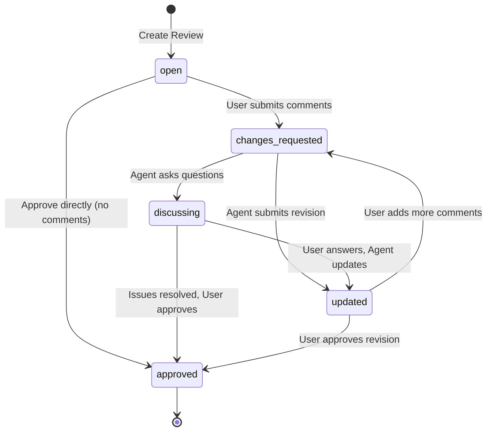

# Claude Code Plan Review Plugin

[English](./README.md) | [中文](./README_zh.md)

A Claude Code plugin that provides human review capability for Plan Mode. The plugin intercepts `ExitPlanMode` calls via hooks and opens a browser-based review interface where users can annotate and provide feedback on Claude-generated plans.

## Features

- **ExitPlanMode Interception**: Automatically intercepts plan submissions for human review
- **Inline Comments**: Attach comments to specific text selections (like GitLab MR review)
- **Batch Review**: Create multiple draft comments before submitting
- **Version History**: Track plan revisions with diff comparison
- **Real-time Updates**: SSE-based live updates in the browser

## Installation

### Via Claude Code CLI
```bash
# Add GitHub marketplace
claude plugin marketplace add zhcsyncer/cc-plan-review

# Install the plugin
claude plugin install cc-plan-review@cc-collab-plugins
```

### Via Claude Code Interactive
```
/plugin marketplace add zhcsyncer/cc-plan-review
/plugin install cc-plan-review@cc-collab-plugins
```

Or simply use `/plugin` and follow the interactive prompts.

### Update Plugin

**Step 1: Update marketplace**
```bash
claude plugin marketplace update
```

**Step 2: Update the plugin via Claude Code**
1. Enter `/plugin` command
2. Select `2. Manage and uninstall plugins`
3. Press Enter on the `cc-plan-review` plugin
4. Press Enter again
5. Select `Update now`

### From Source (Development)
```bash
git clone https://github.com/zhcsyncer/cc-plan-review.git
cd cc-plan-review
pnpm install && pnpm build
claude plugin add ./cc-plan-review
```

## How It Works

The plugin consists of two components working together:

### 1. Hooks (PreToolUse)
Intercepts `ExitPlanMode` calls and triggers the review workflow:
```
ExitPlanMode called → Hook intercepts → Opens browser → User reviews → Returns approve/block
```

### 2. MCP Server
Provides tools and resources for the review workflow:

**Tools:**
- `ask_questions`: Agent asks clarifying questions or acknowledges user comments

**Resources:**
- `review://project/{projectPath}/pending`: Get all pending reviews for a specific project
- `review://project/{projectPath}/current`: Get the most recent pending review
- `review://{id}`: Get specific review details by ID

## Review Status Flow



## Known Limitations

### Post-Approval Mode Switching

When the user approves a plan in the review interface, the plugin returns an "approve" decision to Claude Code. However, there is a known limitation:

**Issue**: After the hook returns `approve`, Claude Code does not automatically switch from Plan Mode to Accept Edits Mode.

**Workaround**: After approving a plan, users need to manually:
1. Wait for Claude to acknowledge the approval
2. Use the `/acceptedits` command or switch to "Auto Accept" mode in Claude Code
3. Then Claude will start implementing the approved plan

This is a limitation of the Claude Code hooks system, which can only approve/block tool calls but cannot trigger mode switches or execute additional commands automatically.

## Data Persistence

Review data is stored in the following directory:
```
~/.cc-plan-review/reviews/
```

Each review session is saved as a JSON file with the review ID as the filename.

## Tech Stack

- **Frontend**: Vue 3, Rsbuild, TailwindCSS
- **Backend**: Node.js, Express 5, MCP SDK

## Development

```bash
pnpm install        # Install dependencies
pnpm dev            # Watch mode
pnpm build          # Full build (server + scripts + client)
pnpm start          # Start server
```
