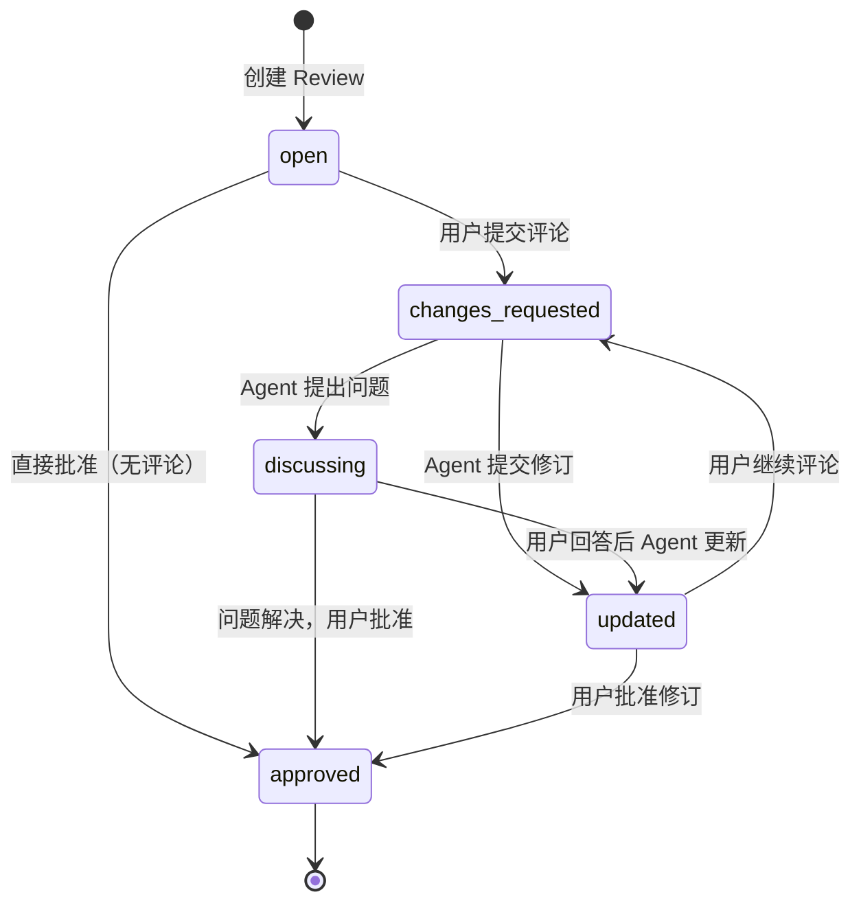

# Claude Code 计划审核插件

[English](./README.md) | [中文](./README_zh.md)

一个 Claude Code 插件，为 Plan Mode 提供人工审核能力。插件通过 hooks 拦截 `ExitPlanMode` 调用，在浏览器中打开审核界面，用户可以对 Claude 生成的计划进行批注和反馈。

## 主要功能

- **ExitPlanMode 拦截**：自动拦截计划提交，触发人工审核
- **行内评论**：针对特定选定的文本添加评论（类似 GitLab MR 审查）
- **批量审查**：在提交之前创建多个草稿评论
- **版本历史**：追踪计划修订，支持差异对比
- **实时更新**：基于 SSE 的浏览器实时更新

## 安装

### 通过 Claude Code CLI
```bash
# 添加 GitHub marketplace
claude plugin marketplace add zhcsyncer/cc-plan-review

# 安装插件
claude plugin install cc-plan-review@cc-collab-plugins
```

### 通过 Claude Code 交互式命令
```
/plugin marketplace add zhcsyncer/cc-plan-review
/plugin install cc-plan-review@cc-collab-plugins
```

或直接使用 `/plugin` 命令进入交互式安装流程。

### 更新插件

**第一步：更新 marketplace**
```bash
claude plugin marketplace update
```

**第二步：通过 Claude Code 更新插件**
1. 输入 `/plugin` 命令
2. 选择 `2. Manage and uninstall plugins`
3. 在 `cc-plan-review` 插件上按 Enter
4. 再次按 Enter
5. 选择 `Update now`

### 从源码安装（开发者）
```bash
git clone https://github.com/zhcsyncer/cc-plan-review.git
cd cc-plan-review
pnpm install && pnpm build
claude plugin add ./cc-plan-review
```

## 工作原理

插件由两个组件协同工作：

### 1. Hooks (PreToolUse)
拦截 `ExitPlanMode` 调用并触发审核流程：
```
ExitPlanMode 调用 → Hook 拦截 → 打开浏览器 → 用户审核 → 返回 approve/block
```

### 2. MCP Server
提供工具和资源用于审核流程：

**工具 (Tools)：**
- `ask_questions`：Agent 针对用户评论提出澄清问题或确认接受

**资源 (Resources)：**
- `review://project/{projectPath}/pending`：获取指定项目的所有待审核 reviews
- `review://project/{projectPath}/current`：获取指定项目最近的待审核 review
- `review://{id}`：根据 ID 获取指定 review 详情

## 审核状态流转



## 注意事项

### 审核通过后的模式切换

当用户在审核界面中批准计划后，插件会向 Claude Code 返回 "approve" 决定。但存在以下已知限制：

**问题**：Hook 返回 `approve` 后，Claude Code 不会自动从 Plan Mode 切换到 Accept Edits Mode。

**解决方法**：批准计划后，用户有两种选择：
1. **等待提示**：等待 Claude Code 在终端显示 "Accept Edits" 提示后确认
2. **手动切换**：按 `Shift+Tab` 手动切换到 Accept Edits 模式

这是 Claude Code hooks 系统的限制，它只能批准/阻止工具调用，无法自动触发模式切换。

### Hook 超时限制（10 分钟）

Claude Code hooks 系统对 PreToolUse hooks 有 **10 分钟超时限制**。如果审核时间超过 10 分钟：

**超时行为**：
- Hook 将超时，Claude Code 将其视为 **拒绝**（block）
- Claude 将收到一个表示 hook 超时的错误
- 浏览器中的审核会话仍保持打开状态，但会断开连接

**建议**：
- 在 10 分钟内完成审核
- 对于复杂计划，可以先快速添加评论，然后再使用讨论功能进行详细反馈

## 数据持久化

审核数据存储在以下目录：
```
~/.cc-plan-review/reviews/
```

每个审核会话以 JSON 文件形式保存，文件名为审核 ID。

## 技术栈

- **前端**：Vue 3, Rsbuild, TailwindCSS
- **后端**：Node.js, Express 5, MCP SDK

## 开发

```bash
pnpm install        # 安装依赖
pnpm dev            # 监视模式
pnpm build          # 完整构建（服务器 + 脚本 + 客户端）
pnpm start          # 启动服务
```
